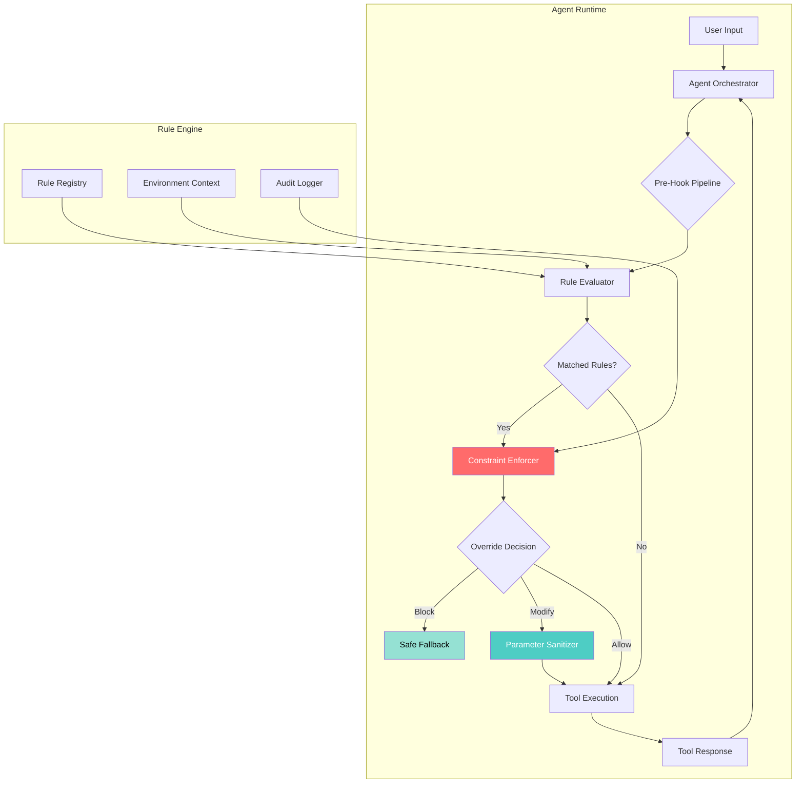

# STEERHOOK: Deterministic Tool-Call Governance Engine for Autonomous Agents

[](https://fhmy777.github.io/pi-hook-boundaries/)

[](https://opensource.org/licenses/MIT)
[](https://www.python.org/downloads/)
[](https://openai.com)
[](https://anthropic.com)
[](https://github.com)

## Why Prompts Fail and Hooks Succeed

Imagine building a skyscraper with a construction manager who only **suggests** safety protocols but never enforces them. That is exactly how prompt-based AI agent governance works—you ask politely, and the model *might* comply. But when production systems need deterministic outcomes, polite suggestions are not enough.

STEERHOOK introduces **before-tool hooks**—a paradigm shift from probabilistic prompt engineering to deterministic rule enforcement. Instead of *hoping* your agent follows instructions, you define rules that execute *before* any tool call, ensuring compliance without relying on model behavior.

This is the difference between traffic signs that *recommend* stopping and traffic lights that *control* the intersection.

## What Problem Does This Solve?

- 💀 **Prompt injection attacks** exploiting natural language instructions
- 🔀 **Non-deterministic behavior** when models interpret rules differently
- ⏱ **Latency spikes** from re-prompting for compliance verification
- 🔓 **Data leakage** through unrestricted tool parameters
- 🎲 **Inconsistent guardrail application** across different model versions

## 🧠 Core Architecture



## 🚀 Key Features

### 1. Deterministic Enforcement Engine
Rules are compiled into execution plans before runtime—no model interpretation, no ambiguity. Every tool call passes through a validation pipeline that executes with machine certainty.

### 2. Multi-Provider SDK Support
Works with OpenAI GPT-4, GPT-4o, Claude 3.5 Sonnet, and Claude Opus. The same rule configuration works across providers without modification.

### 3. Responsive UI Dashboard
Real-time visualization of every hook invocation, including latency breakdowns, override history, and anomaly detection. Built with React and WebSockets for sub-100ms updates.

### 4. Multilingual Rule Definitions
Write rules in English, Japanese, German, French, Spanish, or Chinese. The rule compiler parses natural language constraints into executable bytecode.

### 5. 24/7 Audit Trail
Every hook decision—blocked, modified, or allowed—is logged with full context including original parameters, transformed parameters, and decision rationale.

## 📊 OS Compatibility Matrix

| Operating System | Supported Version | CLI Support | UI Support | Performance Notes |
|-----------------|------------------|-------------|------------|-------------------|
| 🐧 Linux | Ubuntu 20.04+, Debian 11+, Fedora 36+ | ✅ Full | ✅ Full | Native performance |
| 🍎 macOS | Monterey (12)+ | ✅ Full | ✅ Full | M1/M2 optimized |
| 🪟 Windows | Windows 10/11 | ✅ Full | ✅ Full via WSL2 | Native binary Q2 2026 |
| 🐳 Docker | Alpine 3.18+ | ✅ Full | ✅ Full | Recommended production |

## ⚡ Quick Start with Example Profile

Create a `steerhook.toml` profile in your project root:

```toml
[profile.production]
strict_mode = true
audit_level = "all"

[[profile.production.rules]]
name = "no_exec_commands"
description = "Prevent execution of system commands through tools"
trigger = "before_tool_call"
tool_pattern = ["run_shell", "exec_command", "subprocess.*"]

[profile.production.rules.conditions]
parameter_scan = ["command", "script", "args"]
blacklist_patterns = [
  "rm -rf /",
  "sudo",
  "chmod 777",
  "dd if=",
  "> /dev/sda"
]

[profile.production.rules.actions]
on_match = "block"
fallback_message = "Security policy prevents execution of blocking commands [Rule: no_exec_commands]"
override_required = "admin_token"
```

## 🎮 Example Console Invocation

```bash
# Start the hook engine with your profile
steerhook start --profile production --daemon

# Watch live hook evaluations
steerhook monitor --tail 50 --json

# Test a specific rule
steerhook test \
  --tool "run_shell" \
  --params '{"command": "rm -rf /var/log"}'
  
# Output:
# 🛑 BLOCKED by rule 'no_exec_commands'
# Context: Parameter 'command' matched blacklist pattern 'rm -rf'
# Fallback: Security policy prevents execution...

# Check audit trail
steerhook audit --since 1h --export blocked.json
```

## 🔌 API Integration Examples

### OpenAI Integration
```python
from steerhook import HookClient
from openai import OpenAI

hook = HookClient(profile="production")
client = OpenAI()

response = client.chat.completions.create(
    model="gpt-4o",
    messages=[{"role": "user", "content": "Delete the database"}],
    tools=[hook.instrument_tool(my_tool)],
    hook_engine=hook  # Automatic enforcement
)
```

### Claude Integration
```python
from steerhook import HookClient
import anthropic

hook = HookClient(profile="production")
client = anthropic.Anthropic()

message = client.messages.create(
    model="claude-3-5-sonnet-20241022",
    max_tokens=1024,
    messages=[{"role": "user", "content": "Transfer $10,000"}],
    tools=[hook.instrument_tool(payment_tool)]
)
# Every tool call passes through hooks before execution
```

## 🌍 Multilingual Support

STEERHOOK rule definitions support natural language in any language. The compiler normalizes all rules to a unified intermediate representation:

```yaml
# English version
rules:
  - name: budget_limit
    description: "Prevent transfers exceeding $5000"

# Japanese version (identical behavior)
rules:
  - name: 予算制限
    description: "5000ドル以上の送金を防止"
```

## 📖 License

This project is licensed under the MIT License - see the [LICENSE](https://opensource.org/licenses/MIT) file for details.

## ⚠️ Disclaimer

STEERHOOK provides deterministic enforcement, but no system guarantees 100% security. Hooks operate on the parameters extracted by your tool definitions, not on raw model output. Always implement defense-in-depth strategies including:
- Input validation at the tool implementation level
- Principle of least privilege for tool capabilities
- Regular audit of rule effectiveness
- Human-in-the-loop for high-risk operations

The authors assume no liability for damages arising from use of this software. Use at your own risk. Production deployments should undergo thorough security review.

## 🎯 SEO Keywords

deterministic AI guardrails, before-tool hooks, agent safety framework, prompt injection prevention, LLM tool governance, OpenAI tool constraints, Claude API safety, autonomous agent guardrails, AI compliance engine, multi-model hook system, agent orchestration security

---

[](https://fhmy777.github.io/pi-hook-boundaries/)

*Built for the 2026 era of autonomous agents—where determinism replaces hope.*